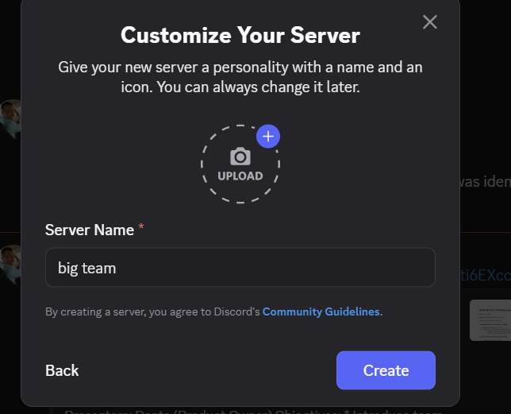

# Discord Server Setup - BIG TEAM

## Server Configuration

**Server Name:** big team

## Purpose
This Discord server was created to facilitate team communication and collaboration for the QueueUp (LFG Web Application) project.

## Setup Details
- Server customization interface accessed
- Server name configured as "big team"
- Channels created for project organization
- Team members invited
- Roles and permissions configured
- Notification settings set up

## Proof of Completion

The screenshot above shows the Discord server "big team" successfully created and configured for team collaboration.
