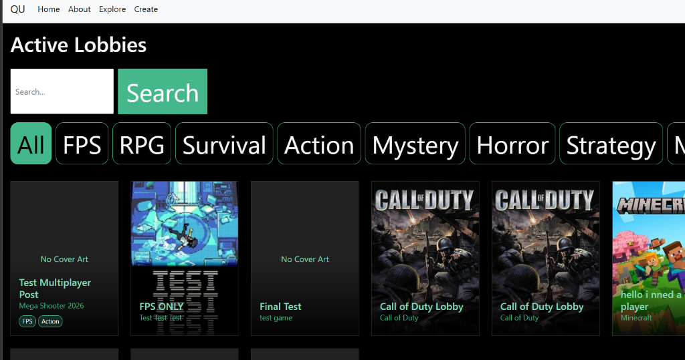
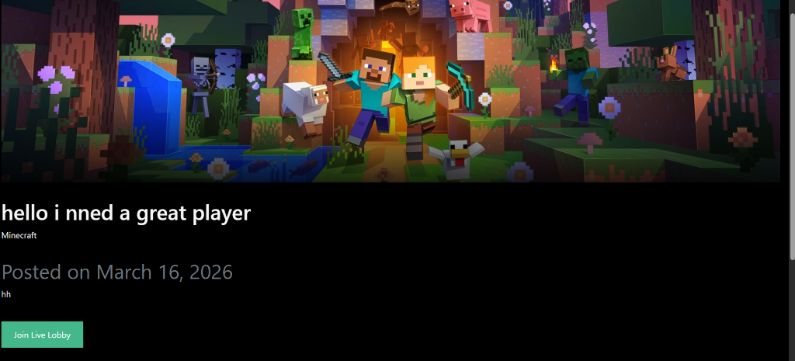
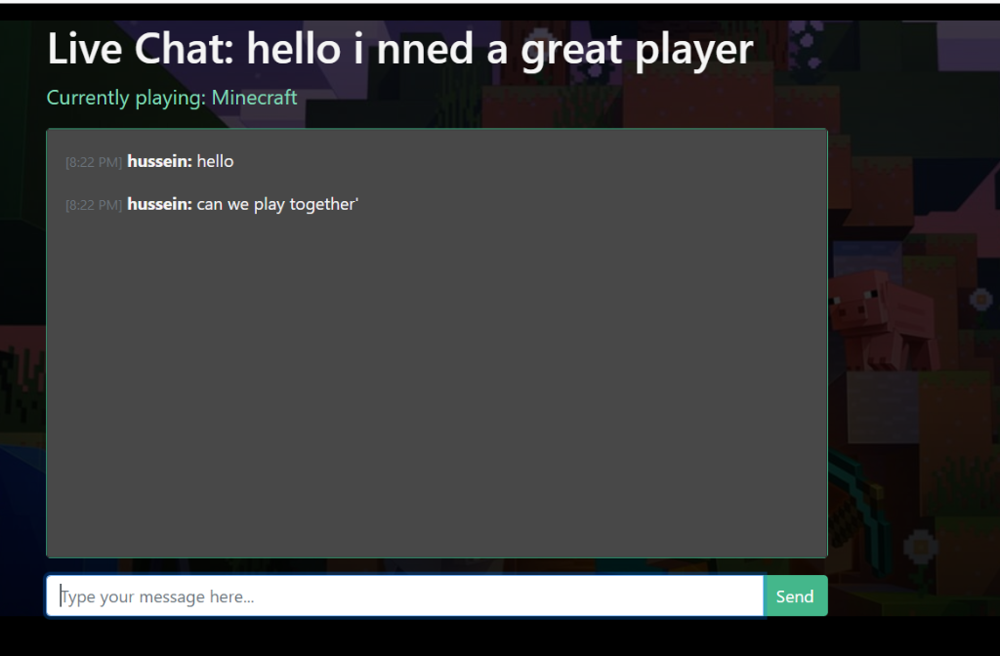
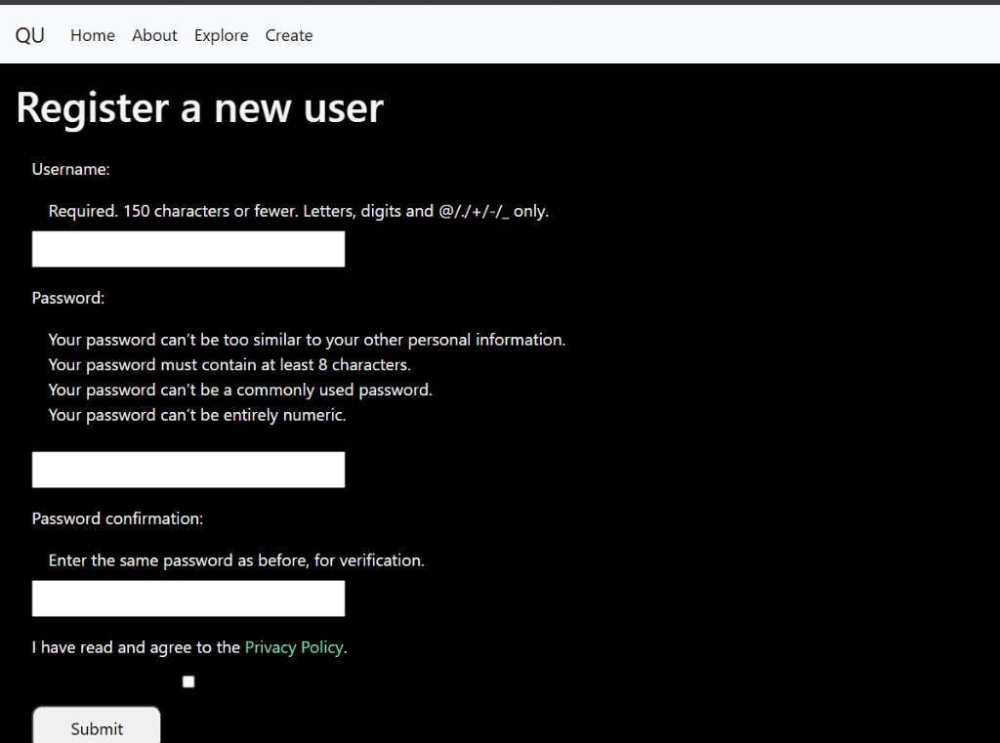
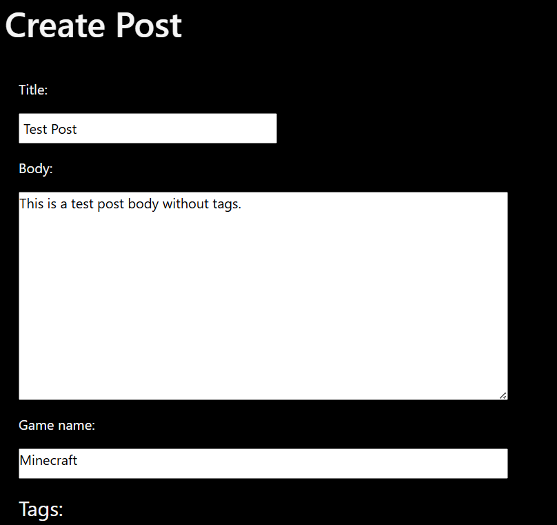
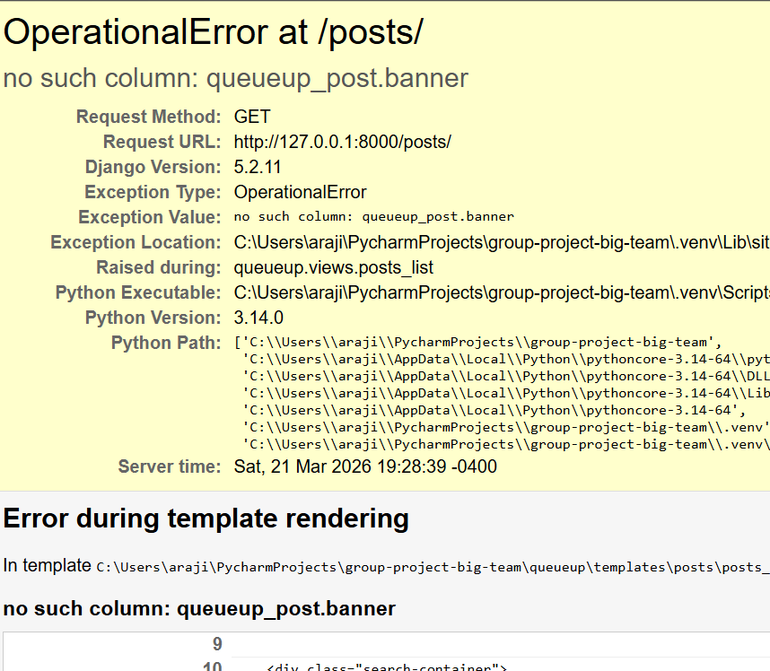
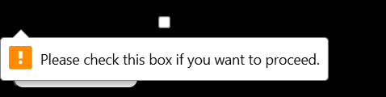

# Hussein's Contributions

## Sprint Review Documents

### Sprint Review 1 – Meeting Agenda Part 1
*Introduction, Status Update*

> Commit: [f888ad7](https://github.com/Carleton-BIT/group-project-big-team/commit/f888ad7)

See full document: [Sprint_Review_Part1.md](Sprint_Review_Part1.md)

---

### Sprint Review 1 – Meeting Agenda Part 2
*Stakeholder Feedback, Next Steps*

> Commit: [97fbe88](https://github.com/Carleton-BIT/group-project-big-team/commit/97fbe88)

See full document: [Sprint_Review_Part2.md](Sprint_Review_Part2.md)

---

## Feature Screenshots

### Active Lobbies Page
Browse all active game lobbies with search and genre filter tags.

---

### Post Page with Game Banner
Individual post page displaying the game banner image, post title, game name, and a "Join Live Lobby" button.

---

### Live Chat Feature
Real-time live chat system inside a lobby, showing timestamped messages from players.

---

### Register Page
User registration form with privacy policy checkbox.

---

### Create Post Page
Form for creating a new lobby post with title, body, game name, and tags.

---

### Debugging – Banner Column Error
Identified and resolved an `OperationalError` where the `banner` column was missing from the SQLite database despite migrations being marked as applied.

---

### Privacy Policy Checkbox Validation
Register form validation tooltip prompting users to check the Privacy Policy checkbox before submitting.

